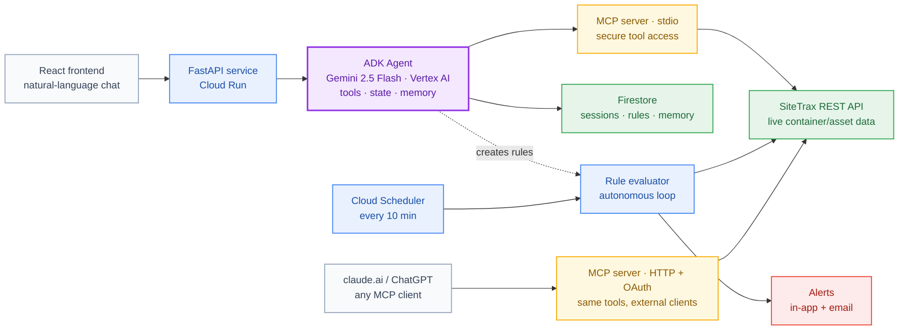

# SiteTrax Atlas Agent

An AI agent for container-yard logistics. You ask questions in plain English
("when was container TCLU1234567 last seen?", "alert me if anything dwells at Newark
over 48 hours") and the agent answers from live SiteTrax.io asset data — or creates a
**monitoring rule** that fires alerts (in-app and email) when the condition is met.

Under the hood it's a **FastAPI** service wrapping a **Google ADK** agent powered by
**Gemini on Vertex AI**, with the SiteTrax data layer exposed to the agent through
**MCP** (Model Context Protocol). Built for **Track 1 of the Google AI Agents Challenge**.

**Contents:**
[How it works](#how-it-works) ·
[Quick start](#quick-start) ·
[Configuration](#configuration) ·
[API reference](#api-reference) ·
[Deploying](#deploying-to-google-cloud) ·
[Tech stack](#tech-stack) ·
[Capabilities & limits](#capabilities--limits) ·
[Assumptions](#design-assumptions) ·
[Project layout](#project-layout)

---

## How it works



The diagram mirrors the three things this build demonstrates:

1. **An ADK agent that reasons** — `POST /chat` runs the Gemini agent through an ADK
   `Runner`. The agent picks from its toolset (asset queries, facility analytics, video
   lookup, rule creation, …) and the API returns the answer plus structured tool results
   that the frontend renders as cards.
2. **MCP as the secure tool boundary** — the agent reaches SiteTrax data only through an
   MCP server (stdio, in-process), and a second MCP server (HTTP + OAuth) exposes the
   same tools to external clients like claude.ai and ChatGPT. Credentials live with the
   MCP servers, never with the model.
3. **An agent that acts, not just responds** — ask for an alert and the agent creates a
   *rule* from a template (`container_arrival` or `dwell_time`). **Cloud Scheduler** then
   drives `POST /tasks/evaluate` every 10 minutes; the evaluator re-checks live data,
   dedupes, and fires new alerts in-app and (optionally) via **Resend** email — with no
   human in the loop.

State (chat sessions, rules, logged opportunities, artifacts) lives in **Firestore** when
deployed; locally it defaults to in-memory so you can run with zero GCP setup beyond Vertex.

---

## Quick start

**Prereqs:** Python 3.11+, Node 18+, the `gcloud` CLI, and a GCP project with billing and
the **Vertex AI API** enabled (your account needs *Vertex AI User* or broader).

```bash
# Terminal 1 — backend (http://localhost:8000)
cd backend

python3 -m venv .venv && source .venv/bin/activate
pip install -r requirements.txt

# Authenticate — the agent uses ADC, no API keys anywhere
gcloud auth application-default login

cp .env.example .env       # then set GOOGLE_CLOUD_PROJECT to your project ID

uvicorn app.main:app --reload --port 8000
```

```bash
# Terminal 2 — frontend (http://localhost:5173)
cd frontend
npm install
npm run dev
```

Check the backend is up:

```bash
curl http://localhost:8000/health
# {"status":"ok","agent":"sitetrax_coordinator","backend":"vertex","gemini_configured":true}
```

Then talk to it — open **http://localhost:5173**, or via the API directly:

```bash
curl -X POST http://localhost:8000/chat \
  -H 'Content-Type: application/json' \
  -d '{"message": "Which facility was busiest this week?"}'
```

Out of the box it runs on **bundled mock data** — no SiteTrax account needed. Interactive
API docs are at `http://localhost:8000/docs`, and the frontend's dev proxy expects the
backend on port 8000. You can also drive the agent through ADK's dev UI:
`adk web agents/sitetrax_coordinator` (from `backend/`).

---

## Configuration

Everything is configured through `backend/.env` (see `backend/.env.example`). The defaults
give you a fully working local demo; each block below unlocks one capability.

### Core (required)

| Variable | Default | Description |
|---|---|---|
| `GOOGLE_GENAI_USE_VERTEXAI` | `TRUE` | Use Vertex AI with ADC (keep `TRUE`) |
| `GOOGLE_CLOUD_PROJECT` | — | Your GCP project ID |
| `GOOGLE_CLOUD_LOCATION` | `us-central1` | Vertex AI region |
| `GOOGLE_MODEL` | `gemini-2.5-flash` | Gemini model |

### Live SiteTrax data (optional — mock data otherwise)

| Variable | Default | Description |
|---|---|---|
| `USE_REAL_API` | `false` | `true` = query the live SiteTrax REST API |
| `SITETRAX_API_BASE` | — | SiteTrax REST base URL |
| `SITETRAX_ACCESS_TOKEN` / `SITETRAX_REFRESH_TOKEN` | — | JWT pair; access token auto-refreshes before expiry and on 401 |
| `SITETRAX_REFRESH_SKEW_SECONDS` | `60` | Refresh this many seconds before expiry |

### Persistence (optional locally, automatic on Cloud Run)

| Variable | Default | Description |
|---|---|---|
| `USE_FIRESTORE` | `false` local / `true` on Cloud Run | Persist sessions, rules, opportunities, artifacts in Firestore |

One-time Firestore setup: enable `firestore.googleapis.com`, create a **Native-mode**
database, grant your identity / the service account **Datastore User**. If Firestore is
enabled but unreachable, the server fails fast at startup rather than silently losing data.

### Email alerts (optional — alerts are in-app + logs otherwise)

| Variable | Default | Description |
|---|---|---|
| `EMAIL_PROVIDER` | `none` | `none` = log only · `resend` = send email |
| `RESEND_API_KEY` | — | Resend API key |
| `ALERT_EMAIL_TO` | — | Default recipient (a rule's own `email` param wins) |
| `ALERT_EMAIL_FROM` | `onboarding@resend.dev` | Sender address |

### Operational

| Variable | Default | Description |
|---|---|---|
| `TASKS_TOKEN` | — | If set, `/tasks/evaluate` requires it as the `X-Tasks-Token` header |
| `ENABLE_POLLER` / `EVAL_INTERVAL_SECONDS` | `false` / `300` | Local background rule-evaluation loop (use Cloud Scheduler in prod) |
| `ALLOW_ORIGINS` | `*` | CORS allowlist — set to your frontend URL in production |
| `MCP_CLIENT_SECRET` / `MCP_SERVER_URL` | — | Remote MCP server only: OAuth shared secret + its public URL |
| `PORT` | `8000` | Server port (Cloud Run injects its own) |

---

## API reference

| Method | Path | Description |
|---|---|---|
| `GET` | `/health` | Service health + model/auth status |
| `GET` | `/health/data` | Live data source reachability/auth |
| `POST` | `/chat` | `{"message": "...", "session_id?": "..."}` → `{text, session_id, tool_results}` |
| `GET` | `/chat/sessions` | List saved chat sessions |
| `GET` | `/chat/history/{id}` | Reload a saved session |
| `DELETE` | `/chat/sessions/{id}` | Delete a session |
| `GET` | `/rules` | List monitoring rules |
| `DELETE` | `/rules/{id}` | Delete a rule |
| `POST` | `/simulate-event` | Inject a synthetic detection event (demo button) |
| `POST` | `/tasks/evaluate` | Evaluate all rules against fresh data; fires new alerts (Scheduler target) |
| `GET` | `/opportunities` | Automation gaps the agent has logged |
| `GET` | `/assets` · `/assets/{container_id}` | Direct asset queries / latest scan |

---

## Deploying to Google Cloud

### One-command deploy (recommended)

`backend/deploy.sh` builds and pushes the image, deploys to **Cloud Run** with the env
vars from your `.env`, optionally deploys the remote MCP server, and wires up
**Cloud Scheduler**:

```bash
# One-time project setup
gcloud auth login && gcloud auth application-default login
gcloud config set project <PROJECT_ID>
gcloud services enable run.googleapis.com cloudbuild.googleapis.com \
  cloudscheduler.googleapis.com firestore.googleapis.com aiplatform.googleapis.com

cd backend
./deploy.sh [--region us-central1] [--service my-service] [--skip-mcp]
```

The Cloud Run **service account needs**:

| Role | For |
|---|---|
| `roles/aiplatform.user` | Gemini via Vertex AI |
| `roles/datastore.user` | Firestore persistence |

No key files are involved at any point — Cloud Run's service account provides ADC, the
same way your `gcloud` login does locally.

### CI deploy (Cloud Build)

```bash
cd backend
gcloud builds submit --config=cloudbuild.yaml \
  --substitutions=_REGION=us-central1,_SERVICE=<service-name> .
```

Builds, pushes (`:$SHORT_SHA` + `:latest`), and deploys. Store secrets
(`sitetrax-access-token`, `sitetrax-refresh-token`, `tasks-token`, `resend-api-key`) in
**Secret Manager** and grant the Cloud Build service account `secretAccessor`.

### Plain Docker

```bash
cd backend
docker build -t sitetrax-backend .

docker run -p 8000:8000 \
  -e GOOGLE_GENAI_USE_VERTEXAI=TRUE \
  -e GOOGLE_CLOUD_PROJECT=<your-project> \
  -e GOOGLE_CLOUD_LOCATION=us-central1 \
  -e GOOGLE_APPLICATION_CREDENTIALS=/adc.json \
  -v "$HOME/.config/gcloud/application_default_credentials.json:/adc.json:ro" \
  sitetrax-backend
```

### Scheduler (if not using deploy.sh)

```bash
gcloud scheduler jobs create http sitetrax-eval \
  --schedule="*/10 * * * *" \
  --uri="https://<your-cloud-run-url>/tasks/evaluate" \
  --http-method=POST \
  --headers="X-Tasks-Token=<token>" \
  --location=us-central1
```

---

## Tech stack

**Google:**

| | |
|---|---|
| **Gemini 2.5 Flash** (Vertex AI) | The agent's model — ADC auth, no API keys |
| **Google ADK** | Agent framework: function tools, MCP toolset, sessions, state, memory, artifacts, callbacks |
| **Cloud Run** | Stateless container hosting (backend + remote MCP server) |
| **Firestore** | Durable storage for sessions, rules, opportunities, artifacts |
| **Cloud Scheduler** | Periodic rule evaluation |
| **Cloud Build** | CI image build + deploy |

**Everything else:**

| | |
|---|---|
| **FastAPI + Uvicorn** | HTTP layer |
| **MCP / FastMCP** | Protocol layer between the agent and SiteTrax data tools |
| **React + Vite + Tailwind CSS** | Chat UI with result cards and a demo bar |
| **httpx · Pydantic · python-dotenv** | HTTP client, validation, config |
| **Resend** (optional) | Alert email delivery |
| **SiteTrax.io REST API** | Live container/asset data (read-only; configured entirely via env) |

---

## Capabilities & limits

### What the agent can do

- **Container lookups** — search by ID/location/status, latest scan, full detection
  timeline, dwell time, journey across facilities.
- **Facility & yard analytics** — recent activity, inventory, daily metrics, busiest
  facility, health checks, time-of-day patterns.
- **Operational analysis** — status distribution, detention lists, inbound/outbound,
  review queues, camera health, duplicates, turnaround times, missing containers.
- **Video & images** — find detection footage and stills for a container or facility.
- **Reports & export** — facility comparisons, generated reports, CSV export (stored as
  ADK artifacts).
- **Product knowledge** — a built-in SiteTrax reference KB for "how does X work" questions.
- **Monitoring rules** — created conversationally from two templates: *container arrival*
  and *dwell-time threshold*.
- **Memory** — session state for user preferences, cross-session recall via ADK memory,
  and conversational references ("that same container") that survive restarts.

### Known limits

- **Two rule templates only** — arrival and dwell. Anything else the agent can't automate
  gets logged to `/opportunities` instead of failing silently.
- **Two alert channels** — in-app and email. Requests for SMS/Slack/voice are recorded as
  opportunities (deterministically, in code — not left to the model).
- **Read-only integration** — the agent never writes to SiteTrax, only to its own state.
- **Mock data is static** — rules auto-fire once then dedup; continuously changing alerts
  need `USE_REAL_API=true`.

---

## Design assumptions

- **No API keys, ADC everywhere.** Gemini auth is Application Default Credentials — your
  user locally, the service account on Cloud Run. The only secrets are third-party tokens
  (SiteTrax JWTs, Resend), supplied via env.
- **Stateless service.** Cloud Run instances come and go, so anything durable goes to
  Firestore. In-memory mode exists purely for local dev.
- **Scheduler over background loops.** In-process pollers aren't reliable on Cloud Run, so
  production evaluation is Cloud Scheduler → `/tasks/evaluate` (idempotent and deduped, so
  overlapping calls are safe). `ENABLE_POLLER` is a local convenience.
- **Single tenant, demo-grade auth.** One SiteTrax account per deployment; `/chat` has no
  end-user auth and CORS defaults to `*` — set `ALLOW_ORIGINS` and `TASKS_TOKEN` for
  anything public.
- **Deterministic guardrails over prompt hopes.** Unsupported requests (alert channels,
  rule types) are handled in code paths that log opportunities — the model can't "forget"
  to do it.
- **Time normalization.** Live timestamps are normalized to UTC, and date filters snap to
  the SiteTrax dashboard's business-day boundary so the agent's numbers match what users
  see in the dashboard.

---

## Tests

```bash
cd backend
pytest tests/             # unit tests: facility matching, API mappings, error handling, retries
python eval/run_eval.py   # agent tool-routing eval (in-memory, no live data or Firestore)
python eval/test_mcp.py   # MCP server end-to-end check
```

## Project layout

```
.
├── backend/                          # FastAPI + ADK agent service — see backend/README.md
│   ├── app/
│   │   ├── main.py                   # FastAPI app, endpoints, ADK Runner wiring
│   │   ├── agent.py                  # ADK agent: tools, prompt, memory callbacks
│   │   ├── mcp_server.py             # stdio MCP server (consumed by the agent)
│   │   ├── mcp_http_server.py        # remote MCP server (HTTP + OAuth, separate deploy)
│   │   ├── data/                     # data layer — mock_data.py ⇄ sitetrax_client.py (USE_REAL_API)
│   │   ├── knowledge/                # SiteTrax product/data-model reference KB
│   │   ├── monitoring/               # rule templates, evaluator, in-memory ⇄ Firestore stores
│   │   └── notifications/            # alert dispatch — log ⇄ Resend (EMAIL_PROVIDER)
│   ├── agents/sitetrax_coordinator/  # ADK CLI entry point (`adk web`, `adk deploy`)
│   ├── tests/  ·  eval/              # unit tests · agent evals
│   ├── Dockerfile  ·  Dockerfile.mcp
│   ├── deploy.sh  ·  cloudbuild.yaml
│   └── .env.example
├── frontend/                         # React + Vite + Tailwind chat UI — see frontend/README.md
├── LICENSE                           # MIT
└── README.md
```

## License

[MIT](LICENSE)
